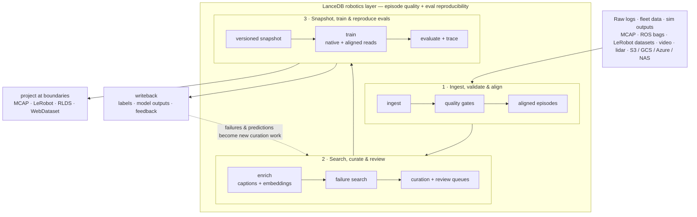

# LanceDB Robotics Lakehouse

> **Prototype / research project.** This repository is exploratory, not a
> supported production product. APIs, schemas, benchmarks, and conclusions are
> subject to change; use it to understand the architecture and trade-offs behind
> LanceDB-backed robotics data loops.

**LanceDB is the episode-quality and evaluation-reproducibility layer for
robotics AI teams.** Keep your raw logs, labelers, training code, and experiment
trackers in place. Add one shared LanceDB-backed layer that turns scattered
robot data into validated episodes, searchable failure sets, reproducible
train/eval snapshots, and traceable relabeling loops.



Read it top to bottom: raw data enters, quality and alignment gates turn it into
trustworthy episode windows, those windows become versioned train/eval
snapshots, and the dashed edge is the point — evaluation and deployment feed
**writeback** back into curation, so the pipeline is a **closed loop**, not a
one-way export.

> The package, import path, and CLI are all `lancedb-robotics` /
> `lancedb_robotics`. This repo (`lancedb-robotics-lakehouse`) is the design
> workspace and reference implementation.

---

## Who this is for

You train robot policies, world models, or AV stacks. Your hard question is not
just "where are the logs?" It is "which episodes are model-ready, why did this
evaluation slice fail, and can I recreate the exact data that produced this
checkpoint?"

Today that answer usually lives across glue scripts: converters, quality checks,
a vector database, a metadata warehouse, label exports, replay tooling,
experiment trackers, and training shards — each maintained separately and
re-synced by hand.

`lancedb-robotics` collapses that loop into one versioned robotics data layer.
**You don't need to know LanceDB to use it** — the rest of this README is the
gentle introduction.

It's built for the people around that loop too: the **platform and data
engineers** who operate ingestion, validation, indexing, and training delivery;
the **simulation and synthetic-data teams** who need generated scenes and sim
failures tied back to real source scenarios; and the **labeling and data-ops
teams** whose review decisions should write back into the same substrate
researchers train from.

## The problem: episode quality is the bottleneck

Robot **capture formats are write-optimized.** MCAP, rosbag2, and HDF5 are
time-ordered, chunked, and built for sequential replay and bandwidth-limited edge
recording. That's exactly right for logging.

**Research iteration is episode-optimized.** A researcher wants the opposite:
random, shuffled, high-throughput access to aligned windows across the *entire*
corpus — plus the ability to ask questions before loading a single byte:
"every failed pick episode with wrist-camera occlusion," "all eval regressions
for this checkpoint," or "the exact snapshot that trained this model."

Point a dataloader straight at MCAP and you pay per-chunk decompression to seek,
open thousands of files for a global shuffle, and scan everything to filter. So
nobody trains on raw logs — everyone first converts to *something* training
friendly. **That in-between layer — versioned, randomly accessible, indexable
multimodal storage with episode semantics, quality state, and eval lineage — has
no incumbent, and every serious team hand-rolls it.** That's the slot this
project fills.

## Why LanceDB? (a 60-second primer)

[**Lance**](https://github.com/lancedb/lance) is an open-source columnar data
format — think of it as a successor to Parquet, but designed for AI and
multimodal data. **LanceDB** is the database layer on top: vector search,
full-text search, and versioning over Lance tables. Four properties make it the
right fit for robot data:

| Robot-data pain | What Lance/LanceDB gives you |
| --- | --- |
| Dataloaders starved by sequential formats | **Fast random access** (point lookups by row id; ~1.5M IOPS on the format) — no row-group tax, no opening thousands of files to shuffle. |
| Video / lidar / point clouds stored as external pointers | **Blobs are first-class columns.** Large binaries live *in* the table and stream lazily by row — one source of truth, not a parallel blob store. |
| A vector DB **and** a search index **and** a metadata warehouse, all re-synced | **One table holds it all** — embeddings, full text, scalar metadata, and payloads — so semantic + keyword + filter queries run in one place. |
| Re-exporting the whole dataset to add a label or embedding | **Versioning + zero-copy schema evolution.** Enriching ten million frames with a new caption or embedding is a *column add*, not a rewrite. Every snapshot is reproducible. |

This isn't hypothetical. NVIDIA's internal data platform **SILA** (Cosmos 3, May
2026) moved to a single Lance dataset as its source of truth — retiring a
Postgres-table-per-pipeline + CDC architecture — and reported **~10× curation
throughput** and job startup cut from 30–60 min to ~5 min, with embeddings and
metadata co-located (no separate vector DB). The research project
**stable-worldmodel** (Mila/NYU/Brown) ships Lance as its default data layer with
published Push-T throughput ~3.4–3.6× over HDF5/MP4 locally.

## What `lancedb-robotics` adds on top

LanceDB gives you the storage primitives. `lancedb-robotics` adds the
**robotics-shaped domain layer** — the schemas, workflows, SDK, and CLI that make
episode quality and evaluation reproducibility first-class concepts:

- **Canonical tables** for sources, runs, observations, events, scenarios,
  episodes, aligned frames/ticks, snapshots, training/eval manifests, curation,
  writeback, lineage, and feedback.
- **Episode-quality gates** that validate required streams, decode capability,
  timestamp monotonicity, alignment, quarantine state, and source evidence before
  data reaches a training snapshot.
- **Evaluation reproducibility** through pinned snapshots, train/eval manifests,
  model-output writeback, and lineage from a failed metric back to the exact
  source rows and labels.
- **A phase-by-phase SDK and CLI** — ingest, validate, align, enrich, search,
  curate, snapshot, train, evaluate, export, and feed results back.
- **Native *and* aligned training reads** straight from pinned snapshots —
  projection, filters, deterministic shuffle, temporal windows, and PyTorch
  adapters, with boundary projections (LeRobot / RLDS / WebDataset) only when an
  external tool needs that shape.
- **LeRobot as a first-class ingest source, not just an export target** —
  `ingest lerobot` maps an existing LeRobot dataset directory or HF Hub repo id
  straight into canonical `episodes` and frame-grain `observations` (LeRobot is
  already episode/frame-shaped, so this skips the MCAP/ROS decoder registry
  entirely), with durable, resumable job tracking (checkpoints, claim/heartbeat
  leases, watchdog recovery).
- **Lineage that crosses machines** — content-addressed IDs so a bad checkpoint
  traces back to its exact training slice and source log.
- **Swappable implementations** behind stable interfaces: Lance/LanceDB OSS,
  LanceDB Enterprise (`db://`), [Geneva](https://github.com/lancedb/geneva), or
  external systems can all sit behind the same APIs.

A guiding principle: **Lance is the index *and* the fast-access layer** —
not merely a pointer index. Payloads (including video and large binaries) live in
Lance as blob-encoded columns, enrichment is additive (`add_columns` +
versioning, never in-place updates), and search/curation/training all read from
Lance. The raw log stays archival truth, not a runtime dependency.

---

## Quickstart

Requires Python 3.11+ and [uv](https://docs.astral.sh/uv/).

```bash
# Install the package + dev tooling into .venv
uv sync --extra dev

# Confirm the CLI is wired up
uv run lancedb-robotics --help
uv run lancedb-robotics --version
```

Payload decoders and integrations are optional, lazily-imported extras — the base
install decodes JSON and leaves anything else as `raw` (never a crash). Add the
families you need:

```bash
uv sync --extra ros1          # ROS 1 (didi, demo logs)
uv sync --extra ros2          # ROS 2 / CDR
uv sync --extra protobuf      # Protobuf / Foxglove (nuScenes)
uv sync --extra flatbuffer    # FlatBuffers with embedded .bfbs schemas
uv sync --extra cbor          # CBOR
uv sync --extra msgpack       # MessagePack
uv sync --extra rosbag        # ROS 1 .bag and ROS 2 sqlite .db3 containers
uv sync --extra object-store  # open s3:// / gs:// / az:// lakes and raw logs
uv sync --extra embeddings    # real sentence-transformers / CLIP providers
uv sync --extra media         # image/array media materialization helpers
uv sync --extra torch         # PyTorch previews, datasets, dataloaders
uv sync --extra lerobot       # native LeRobot ingest + projection validation/loading
uv sync --extra rlds          # RLDS / TF / TFDS / Reverb (Linux x86_64, Py 3.11/3.12)
uv sync --extra webdataset    # WebDataset projection export/loading
```

> **Notes on a few extras.** LeRobot and RLDS resolve in *separate* environments
> for now (LeRobot needs NumPy 2.x; the RLDS/Reverb/TensorFlow line needs NumPy
> <2). The upstream `rlds` package is only verified on the Linux x86_64 / Python
> 3.11 lane — on macOS arm64 the native RLDS tests skip; run
> `scripts/verify-rlds-native-docker.sh` for the supported-platform check. The
> `embeddings` extra pins `sentence-transformers` to the text-capable 3.x line;
> if a model dependency is present but fails to import, the provider degrades to
> the deterministic `demo` provider with a warning on stderr rather than
> crashing, so search and enrich keep working. Pass `--strict` to make that
> degradation an error.

### Semantic vs. deterministic search providers

`scenarios enrich` can write embeddings with several providers. The default
`demo` provider and the `hashed-text` provider are deterministic offline
stand-ins: useful for repeatable tests and local pipeline smoke checks, but not
for semantic similarity. Use `sentence-transformers` or `clip` with
`uv sync --extra embeddings` when vector or hybrid search should reflect real
language/image semantics.

If a requested model-backed provider is unavailable, enrich fails open by
warning on stderr and falling back to `demo` so local runs keep moving. Use
`--strict` in reproducible pipelines to fail instead of silently writing fallback
vectors:

```bash
uv run lancedb-robotics scenarios enrich --lake ./demo.robot.lance --provider clip --strict
```

### A vertical slice (CLI)

This is the whole loop end to end: **one raw MCAP log becomes validated episode
windows, searchable failure candidates, and a reproducible training snapshot —
then selected clips can project back out to MCAP** without losing the replay
path. Each step writes canonical Lance rows and records a `transform_runs`
lineage entry, so the pipeline is auditable.

```bash
# 1. Create a lake and look at a raw log without ingesting it
uv run lancedb-robotics lake init --lake ./demo.robot.lance
uv run lancedb-robotics inspect mcap tests/fixtures/sample.mcap --format text

# 2. Ingest → validate → window → enrich
uv run lancedb-robotics ingest mcap tests/fixtures/sample.mcap --lake ./demo.robot.lance
uv run lancedb-robotics quality validate --lake ./demo.robot.lance --profile demo
uv run lancedb-robotics scenarios create --lake ./demo.robot.lance --window 50ms
uv run lancedb-robotics scenarios enrich --lake ./demo.robot.lance   # captions + embeddings

# 3. Search → freeze a reproducible dataset → preview as a training set
uv run lancedb-robotics search hybrid "imu observations" --lake ./demo.robot.lance
uv run lancedb-robotics dataset snapshot create --lake ./demo.robot.lance --from-search last --name demo-v1
uv run lancedb-robotics train preview torch --lake ./demo.robot.lance --snapshot demo-v1

# 4. Export selected clips back to MCAP for replay/labeling tools
uv run lancedb-robotics export mcap --lake ./demo.robot.lance --snapshot demo-v1 --out ./demo-clips
```

The annotated walkthrough — which tables each step touches, the validation gate,
how hybrid search ranks, the snapshot manifest, and how this differs from
MCAP/Foxglove/Rerun — is in
[the baseline showcase narrative](docs/narratives/baseline-ingest-to-training-showcase.md).
It runs as a deterministic test:

```bash
uv run pytest tests/test_integration_showcase.py
```

### The same loop in Python

```python
from lancedb_robotics import Lake
from lancedb_robotics.search import search_scenarios

lake = Lake.open("./demo.robot.lance")

# Hybrid (full-text + vector) search over scenario windows
hits = search_scenarios(lake, mode="hybrid", query="imu observations", limit=10)

# A version-pinned, randomly-accessible, shuffled training view —
# projection, filters, and temporal windows, no new shard layout
dataset = lake.training.dataset(
    "demo-v1",
    columns=["scenario_id", "summary", "embedding"],
    filters={"split": "train"},
    shuffle=True,
    shuffle_seed=17,
)
for sample in dataset:          # PyTorch dataloaders also available via lake.training
    ...

# Plan a boundary projection only when an external tool needs that shape
projection = lake.projections.plan("webdataset", "demo-v1")

# Trace a checkpoint back to its exact training slice and source log
graph = lake.lineage.trace_checkpoint("<model_artifact_id>")
```

Object-store lakes work the same way — pass an `s3://` / `gs://` / `az://` /
`db://` URI and credentials via `--storage-option` or an `--auth-ref`; raw bytes
stay where they live (`runs.raw_uri`) while the lake materializes canonical rows,
decoded columns, embeddings, and indexes. Credentials are resolved in-memory and
never written to lake tables.

---

## What you get (feature breadth)

This separates what's **shipped** from what's planned — it doesn't pretend the
whole product vision is finished. Status legend: **✅ shipped · 🚧 evolving ·
🔭 planned**.

### Ingest & inspect
- ✅ **MCAP ingest**, batched and streaming, with CRC validation and
  quarantine-with-recoverable-prefix instead of failing a damaged log; inspect a
  log without ingesting it.
- ✅ **Payload decoders**: JSON (base), ROS 1, ROS 2 / CDR, Protobuf / Foxglove,
  FlatBuffers, CBOR, MsgPack — each an optional extra; undecodable messages land
  as `raw`. ([robustness & scale](docs/narratives/feature-set-mcap-robustness-and-scale.md),
  [typed field extraction](docs/narratives/feature-set-typed-field-extraction.md))
- ✅ **ROS bag ingest** (ROS 1 `.bag`, ROS 2 sqlite `.db3`); split, summary-less,
  and unindexed MCAP, attachments, metadata records, and compressed chunks.
- ✅ **LeRobot dataset ingest** — a local/object-store LeRobot dataset directory
  or HF Hub repo id maps directly into canonical `episodes` and frame-grain
  `observations` (no MCAP/ROS decoding needed); per-camera MP4 streams are
  recorded as `videos` / `video_encodings` references without re-encoding or
  copying bytes. Durable, resumable job tracking — checkpoints, claim/heartbeat
  leases, stale-claim recovery — plus object-store source validation and
  concurrent media inspection.
- ✅ **Object-store & remote lakes** — `s3://` / `gs://` / `az://` / `db://` and
  namespace-routed connections; credentials resolved at runtime, never persisted.
- 🔭 Automotive ingest (ASAM MDF4); more capture formats via the adapter registry.

### Quality, alignment & episodes
- ✅ **Quality gates**: required-topic / min-count / monotonic-timestamp /
  decode-capability / integrity checks, with quarantine and deliberate CLI exit
  codes; **compact/maintain** that protects snapshot-pinned versions and indexes.
- ✅ **Episodes as first-class objects** — boundaries from teleop markers,
  queries, scenarios, explicit intervals, *or* mined from continuous fleet logs;
  derivation lifecycle + lineage.
  ([episode creation](docs/narratives/episode-creation-and-recreation.md))
- ✅ **Sub-frame multi-rate alignment** into `aligned_frames` / `aligned_ticks`,
  retaining source row references and error bounds. 🚧 sub-frame correctness
  hardening.
- ✅ **Codec-aware video** with GOP/keyframe metadata and lazy Lance blob frame
  access. 🚧 deeper GOP/NVDEC-friendly encoding with a compression-vs-random-access
  knob.

### Enrich, search & curate
- ✅ **Captions + embeddings** behind a pluggable provider contract — real
  sentence-transformers / CLIP (`--extra embeddings`), degrading to a deterministic
  demo provider when no model is present — plus typed field extraction and
  additive enrichment columns.
- ✅ **Search**: scalar, full-text, vector, and hybrid (RRF-fused) over persistent
  FTS and ANN indexes, with transparent score components, all resolving to the
  same versioned rows used for curation and training.
- ✅ **Curation & mining workbench**: dedup, diversify, stratify, mine failures,
  quality filters, saved views, membership decisions, review queues, branch/snapshot
  compare, audit-as-of-time, and distribution-gap analysis. Scales via chunked
  membership, predicate indexes, zero-copy row plans, and resumable distributed
  semantic dedup with recall audits.
- 🔭 Foundation-model-as-indexer for semantic coverage; deeper branch-train-compare.

### Snapshot, train & evaluate
- ✅ **Reproducible dataset snapshots** — freeze any search/selection into a
  version-pinned slice.
- ✅ **Lance-native & aligned training datasets** (`lake.training.dataset` /
  `aligned_dataset`) — version-pinned random access, projection, scalar filters,
  deterministic shuffle, worker/resume controls, temporal windows, late
  media/payload hydration, PyTorch map/iterable/dataloader helpers, loader
  reports, and sample-to-source lineage. No new shard layout.
  ([narrative](docs/narratives/lance-native-training-datasets.md))
- ✅ **Training & evaluation manifests** in canonical Lance tables (snapshot/table
  version pins, code/runtime context, params, checkpoints, metrics, optional
  MLflow/W&B refs) — no external tracker required.
- ✅ **Boundary projections** — export clips back to **MCAP**; open / plan /
  materialize **LeRobot / RLDS / WebDataset** from pinned snapshots, with
  projection manifests and materialization accounting instead of exported shards
  becoming the source of truth.
- 🔭 Replay-layout export (Foxglove layouts, Rerun `.rrd`); JAX loader.

### Lineage & the closed loop
- ✅ **Canonical lineage graph** (`lineage_artifacts` / `_executions` / `_edges`)
  with `refresh_graph()`, upstream `trace(...)`, downstream `impact(...)`,
  cross-machine content-addressed IDs, OpenLineage/DataHub export, source evidence
  packs, invalidation, and rebuild plans.
- ✅ **Writeback** of labels, model outputs, and feedback — failures and
  predictions become new curation work, not sidecar files.
- 🔭 Simulation / reconstruction lineage (NVIDIA Cosmos, Omniverse NuRec, OpenUSD,
  Isaac); scenario standards (OpenLABEL / OpenSCENARIO / OpenDRIVE).

### Reproducibility, benchmarks & coexistence
- ✅ **Reproducible benchmark harness** (`bench run`) across Lance, Enterprise
  Lance, dependency-light LeRobot-default, opt-in official LeRobot-native,
  WebDataset, and Deep Lake paths — records dataset/table versions, hardware,
  and throughput / random-access / curation / storage metrics.
  ([narrative](docs/narratives/reproducible-benchmark-suite.md))
- 🚧 **Enterprise remote training** (`db://` loading, cache/prewarm envelopes,
  fallback status, loader reports) — live-endpoint hardening and larger-scale
  orchestration are tracked follow-ups.
- 🔭 Iceberg / Delta coexistence (tabular plane on Iceberg, multimodal on Lance,
  one foundation); pluggable external search backends.

## Adopt incrementally — no rip-and-replace

Each rung stands alone and delivers value before you climb the next. Keep your
buckets, formats, labelers, trackers, and training code; add LanceDB where it
removes the most friction.

| Step | You keep | `lancedb-robotics` adds | First value |
| --- | --- | --- | --- |
| **0. Register** | Existing buckets / raw formats | Source registration, checksums, schema/topic inventory | Searchable catalog without copying payloads |
| **1. Index** | Existing MCAP / ROS / video | Canonical `runs` / `observations` / `events` + replay links | Find relevant runs and windows in minutes |
| **2. Validate** | Existing ingest & QA | Quality rules, quarantine, alignment | Know which episodes are model-ready |
| **3. Curate** | Existing notebooks | Hybrid search, behavior windows, saved selections | Build targeted datasets from one query surface |
| **4. Snapshot/train/eval** | Existing model code | Versioned snapshots + PyTorch/LeRobot/RLDS reads + eval manifests | Reproduce the data behind a checkpoint or metric |
| **5. Close loop** | Existing sim / label / W&B / MLflow | Writeback of labels, model outputs, feedback | Failures become new curation or relabeling work |

## What stays external

`lancedb-robotics` is deliberately a **substrate, not an application.** Use it
when the bottleneck is proving model-ready episode quality, reproducing the data
behind training/eval results, and turning failures into the next curation or
labeling set. Keep these systems where they're strong, and integrate only when
you choose to:

- raw durability and lifecycle policy in S3/GCS/Azure/NAS;
- fleet operations and incident management;
- labeling UIs and review workforces;
- simulators, reconstruction engines, and world-model stacks;
- experiment trackers such as MLflow and W&B;
- dashboards and operator-facing applications (Foxglove, Roboto, Rerun).

The posture is partner-first: project from LanceDB into the boundary format a
tool expects, then write useful outputs back into the lake with lineage.

## Where this is going

Depth before breadth: make the proven loop *real* and production-shaped, then
extend reach. The near-term substrate core is **episode-native semantics**,
**sub-frame alignment correctness as a tested guarantee**, **codec-aware
GOP/NVDEC video**, and **Enterprise remote training at scale**. Longer-term bets
build on top: foundation-model-as-indexer, deeper sim/reconstruction lineage, and
Iceberg/Delta coexistence. The full sequencing lives in the focused epics:

- [Lance-native training datasets](docs/narratives/lance-native-training-datasets.md) — the default training path over pinned snapshots.
- [Reproducible benchmark suite](docs/narratives/reproducible-benchmark-suite.md) — performance claims as structured reports.

---

## Learn more

- **Manual** (concepts, journeys, reference) — [docs/manual/index.md](docs/manual/index.md)
- **Feature & showcase narratives** — [baseline showcase](docs/narratives/baseline-ingest-to-training-showcase.md) · [Lance-native training](docs/narratives/lance-native-training-datasets.md) · [benchmark suite](docs/narratives/reproducible-benchmark-suite.md)

## Development

```bash
uv sync --extra dev          # install package + all decoders + dev tools
uv run pytest                # full test suite (deterministic fixtures + snapshots)
uv run lancedb-robotics lake --help   # every command group exposes --help
uv run ruff check .          # lint
```

RLDS native conformance runs in CI through the same Linux amd64 Docker verifier
used for local unsupported hosts:

```bash
scripts/verify-rlds-native-docker.sh
# inside the container, the required command is:
LANCEDB_ROBOTICS_REQUIRE_RLDS_NATIVE=1 uv run --no-sync pytest -q -m rlds_native \
  tests/test_projections.py tests/test_dataset_export.py
```

CLI help output is snapshot-tested; after an intentional help-text change,
regenerate with `UPDATE_SNAPSHOTS=1 uv run pytest` and commit the updated
`tests/snapshots/` files. Showcase data and generated lake artifacts live under
`examples/` (gitignored except its README).

## Relationship to `mcap-lancedb`

`mcap-lancedb` stays a focused MCAP/ROS log ingest/conversion engine.
`lancedb-robotics` orchestrates domain workflows *across* MCAP, ROS bags,
LeRobot datasets, object storage, labels, model outputs, simulation feedback,
training snapshots, and boundary projections (LeRobot / RLDS / WebDataset /
Foxglove / Rerun) — using `mcap-lancedb`-class engines as one ingest path among
several, with LeRobot ingest as another first-class one.
