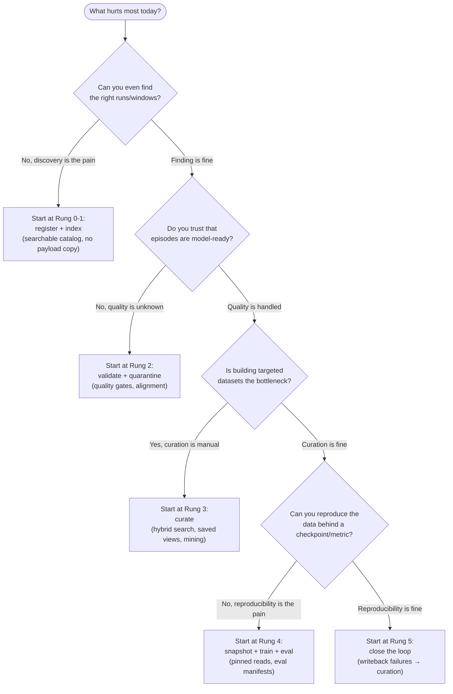

# AI Research Lead evidence pack and onboarding narrative

**For the leader deciding whether to adopt LanceDB + `lancedb-robotics` as the
robotics data substrate — or keep building it in-house on object storage plus a
warehouse, a search cluster, a vector DB, and per-framework training shards.**

The root [README](../../README.md) is the 90-second pitch: what the substrate is,
why LanceDB, and what ships today. This pack is the next layer down — a guided,
time-boxed evaluation you can run yourself, with **every product and performance
claim linked to a source you can inspect**: code, a test, a decision record, a
narrative, a backlog item, or a clearly-labeled external proof point. Nothing
here asks you to take a number on faith.

It deliberately does **not** repeat the README. It assumes you have read the
first screen and want to (a) check the claims, (b) run a small end-to-end path,
and (c) answer the objections a platform team will raise before committing.

---

## How to use this pack (pick a track)

| Track | Time | Path |
| --- | --- | --- |
| **Read** | ~10 min | This pack top to bottom, following the [claim → evidence table](#the-claims-and-how-to-check-each-one) and the [DIY comparison](#why-not-just-build-this-on-cloud-services). No install. |
| **Hands-on** | ~20 min | Install, then run the [guided mini-demo](#guided-mini-demo-raw-log-to-lineage-in-one-sitting) — raw fixture → search → curate → snapshot → training preview → export → lineage — on the checked-in sample log. |
| **Deep-dive** | ~30 min | The above, plus the [benchmark evidence](#benchmark-evidence-what-the-numbers-mean) section and the linked epics, so you can separate what is proven-here, what is methodology, and what is roadmap. |

If you only have time for one thing: run the mini-demo. It is the same command
sequence a deterministic test executes on every CI run, so it cannot rot.

---

## The claims, and how to check each one

The README makes a set of load-bearing claims. Here is where each one is grounded
so you can verify rather than trust. The **Evidence kind** column is the honest
part — it tells you whether a claim is proven *in this repo on a fixture*,
demonstrated *as a methodology*, or cited *from an external source*.

| Claim | Where it is grounded | Evidence kind |
| --- | --- | --- |
| Raw log → validated episodes → searchable windows → reproducible snapshot → training reads → replay export runs end to end | [baseline showcase narrative](baseline-ingest-to-training-showcase.md) + the pinned test [`tests/test_integration_showcase.py`](../../tests/test_integration_showcase.py) | **Local fixture, runnable** |
| Enrichment is additive, never an in-place rewrite; old snapshots stay reproducible | decision [0026](../decisions/0026-blob-safe-additive-write-mechanism.md); `add_columns` semantics | **Design decision + code** |
| Payloads (video, lidar, large binaries) are blob-encoded columns *in* Lance, not external pointers | decision [0024](../decisions/0024-lance-is-the-index-and-fast-access-layer.md) | **Design decision** |
| IDs are content-addressed, so splits/lineage reproduce across machines | decision [0023](../decisions/0023-content-addressed-portable-run-ids.md) | **Design decision + code** |
| One wide table per grain, reached by point `take`/lineage, never a join | decision [0025](../decisions/0025-denormalized-enrich-as-column-data-modeling.md); [open questions](../product/open-questions.md) | **Design decision** |
| Version-pinned, randomly accessible, shuffled training reads straight from a snapshot — no new shard layout | [Lance-native training narrative](lance-native-training-datasets.md) | **Local fixture, runnable** |
| Curation/mining workbench (dedup, diversify, stratify, mine failures, saved views, review queues, distribution gaps) | [curation flywheel epic](../product/curation-flywheel-epic.md); `curate` command group | **Shipped surface** |
| Lineage traces a bad checkpoint back to its exact training slice and source log | [lineage/provenance epic](../product/lineage-provenance-epic.md); `lineage` command group | **Shipped surface** |
| Performance numbers are structured, reproducible reports, not marketing | [reproducible benchmark suite](reproducible-benchmark-suite.md); backlog [0034](../../.miagent/backlog/0034-benchmark-suite.md) | **Methodology** |
| NVIDIA SILA: ~10× curation throughput; job startup 30–60 min → ~5 min on a single Lance source of truth | [product vision → Proof Points](../product/product-vision.md#proof-points) | **External proof point** |
| stable-worldmodel: Push-T throughput ~3.4× over HDF5, ~3.6× over MP4 locally | [product vision → Proof Points](../product/product-vision.md#proof-points) | **External proof point** |
| ~1.5M IOPS random access on the Lance format | [product vision → Proof Points](../product/product-vision.md#proof-points) | **External proof point (LanceDB-published)** |

**Read the evidence-kind column literally.** A "local fixture" number describes a
tiny deterministic sample built for tests — it proves the *code path works and is
reproducible*, not that it is fast at fleet scale. A "methodology" entry means the
machinery to produce a defensible number exists, but the number for *your*
hardware and dataset is something you generate. An "external proof point" is a
third-party or upstream result, cited with its source; it is evidence the
substrate approach scales, not a measurement taken in this repo.

---

## Guided mini-demo: raw log to lineage in one sitting

This is the 20-minute hands-on track. It takes one checked-in raw log fixture and
walks it through the whole loop. **The first ten steps are the exact sequence in
the [baseline showcase](baseline-ingest-to-training-showcase.md), pinned by
[`tests/test_integration_showcase.py`](../../tests/test_integration_showcase.py)**
— so they are guaranteed to match the code. The curation and lineage steps at the
end extend that spine; they use real subcommands (verified to exist by this pack's
own guardrail test — see [How this pack stays honest](#how-this-pack-stays-honest)),
and their exact flags are in the generated [CLI reference](../manual/reference/cli.generated.md)
and every command's `--help`.

### Setup (~2 min)

```bash
uv sync --extra dev
uv run lancedb-robotics --version
```

### Core spine — the pinned, runnable loop (~10 min)

```bash
# 1. Create the lake, then look at a raw log without ingesting it
uv run lancedb-robotics lake init --lake ./demo.robot.lance
uv run lancedb-robotics inspect mcap tests/fixtures/sample.mcap --format text

# 2. Ingest → validate → window → enrich (captions + embeddings)
uv run lancedb-robotics ingest mcap tests/fixtures/sample.mcap --lake ./demo.robot.lance
uv run lancedb-robotics quality validate --lake ./demo.robot.lance --profile demo
uv run lancedb-robotics scenarios create --lake ./demo.robot.lance --window 50ms
uv run lancedb-robotics scenarios enrich --lake ./demo.robot.lance

# 3. Search → freeze a reproducible snapshot → preview as training samples
uv run lancedb-robotics search hybrid "imu observations" --lake ./demo.robot.lance
uv run lancedb-robotics dataset snapshot create --lake ./demo.robot.lance --from-search last --name demo-v1
uv run lancedb-robotics train preview torch --lake ./demo.robot.lance --snapshot demo-v1

# 4. Project selected clips back to MCAP for replay/labeling tools
uv run lancedb-robotics export mcap --lake ./demo.robot.lance --snapshot demo-v1 --out ./demo-clips
```

What to notice, as a leader:

- **`inspect` never touches the lake** — capability (which topics decode) is
  *probed*, not assumed. You look before you move data.
- **`quality validate` is a gate, not a report.** Failing runs are quarantined
  and the command exits non-zero, so a bad log cannot silently reach a snapshot.
- **`dataset snapshot create` pins source table versions**, not a copied corpus.
  The slice is re-readable exactly, and the train/val/test split is a
  deterministic function of the content-addressed run id — reproducible on any
  machine.
- **`train preview` reads the snapshot as of its pinned versions.** There is no
  conversion-to-shards step between curation and training.
- **`export mcap` is a projection, not a migration.** The raw MCAP interchange
  path is preserved; the lake is additive to your replay tooling.

Run the whole spine as a single deterministic test to confirm it on your machine:

```bash
uv run pytest tests/test_integration_showcase.py
```

### Extensions — curation and lineage (~8 min)

These build on the same `demo.robot.lance`. They are illustrative (not part of the
pinned showcase test), so treat the flags as indicative and confirm with `--help`:

```bash
# Curate: persist a logical selection as a named view (no payload copy),
# then mine nearest failure/outlier neighbors into a candidate snapshot.
uv run lancedb-robotics curate save-view --lake ./demo.robot.lance --help
uv run lancedb-robotics curate mine-failures --lake ./demo.robot.lance --help

# Lineage: project canonical rows into the lineage graph, then trace an
# artifact's upstream provenance and audit retained-version cleanup candidates.
uv run lancedb-robotics lineage refresh --lake ./demo.robot.lance
uv run lancedb-robotics lineage trace --lake ./demo.robot.lance --help
uv run lancedb-robotics lineage audit --lake ./demo.robot.lance --help
```

Why this matters for evaluation: curation and lineage are the two capabilities a
DIY stack fragments across a warehouse, a vector DB, and a pile of scripts. Here
they read the **same versioned rows** the training path reads — a saved view, a
mined failure set, and a checkpoint's provenance all resolve against one source of
truth, not three that drift.

The lineage traversal is deliberately built to *expand a bounded frontier* rather
than load the whole graph — see the scale rules in [SKILLS.md](../../SKILLS.md) —
so `trace`/`impact` stay cheap as the graph grows into the millions of edges.

---

## Why not just build this on cloud services?

The README carries the compact comparison table. This is the same comparison with
the **failure mode spelled out** — what specifically breaks, or what you end up
re-inventing, when the working multimodal layer is assembled from generic cloud
services instead of a substrate designed for it. Object storage stays underneath
in every row; the question is what sits *on top* of it.

| If your working layer is… | You keep re-inventing… | The failure mode |
| --- | --- | --- |
| **S3/GCS/Azure/NAS object prefixes** | An index, a query surface, and episode semantics | Object storage is durable but has no queries, no versioned schema, no random access by row. "Show me every failed pick with wrist-camera occlusion" means listing prefixes and opening files. |
| **Parquet / Iceberg / Delta / warehouse tables** | Multimodal payload handling and random access | Row-group scans tax random access; blobs (video/lidar) become external pointers to a *separate* store that drifts from the metadata. Enrichment tends toward table rewrites, breaking older snapshots. |
| **Postgres / bespoke metadata DB** | Scale, multimodality, and co-location | A metadata DB holds pointers, not payloads; embeddings and full text live elsewhere; every query fans out to N systems you must keep in sync. (This is precisely the architecture NVIDIA's SILA *retired* — see Proof Points.) |
| **OpenSearch/Elasticsearch + a separate vector DB** | A single co-located query surface | Keyword, vector, and scalar filters live in different systems over different copies of the data; "hybrid" means application-level fusion and three ingestion pipelines to keep consistent. |
| **Per-framework shards (WebDataset / TFRecord / RLDS / HDF5 / LeRobot)** | Reproducibility and the ability to change a filter cheaply | Each filter/split change is a repacking job that produces a *new* immutable shard set. The shards, not a versioned query, become the source of truth, and lineage back to source bytes is lost. |
| **One-off extraction & alignment scripts** | Everything above, forever, by hand | The glue is unversioned, untested, and re-synced manually; the person who wrote it is the documentation. |

The substrate's answer is one versioned, randomly accessible, indexable Lance
working set — scalar + full text + vector + blob payloads in one table — that
your existing tools *project from and write back to*. You are not asked to throw
anything away; you are asked to stop hand-rolling the layer in the middle.

---

## Benchmark evidence: what the numbers mean

A performance number is only evidence if you can reproduce it. This project treats
that as a hard rule (see the testing standards in [SKILLS.md](../../SKILLS.md):
*"never quote a performance number without a retained artifact"*). Concretely:

- The harness is the [reproducible benchmark suite](reproducible-benchmark-suite.md)
  (backlog [0034](../../.miagent/backlog/0034-benchmark-suite.md)): `bench prepare`
  → `bench run` (or `run-public-lerobot`) → `validate-public-lerobot`.
- Every reportable number is anchored to a **report id + artifact manifest** that
  records the git commit, the pinned dataset revision, the storage tier, the
  format, and the metric. The validator *fails* on a stale manifest or a claimed-
  but-skipped format — a number without that anchor is not a number here.

Read benchmark claims in three tiers, and never blur them:

1. **Local-fixture numbers** (from the deterministic test corpus): they prove a
   code path works and is reproducible. They are *not* scale claims — the fixture
   is a handful of messages.
2. **Methodology numbers** (what *you* generate with `bench run` on your hardware
   and data): the defensible way to get a number for your environment. The suite
   gives you the shape; you produce the value.
3. **External proof points** (cited, third-party or upstream): evidence the
   substrate approach scales in the real world. See
   [product vision → Proof Points](../product/product-vision.md#proof-points) for
   NVIDIA SILA (~10× curation throughput; job startup 30–60 min → ~5 min),
   stable-worldmodel (Push-T ~3.4× over HDF5, ~3.6× over MP4 locally), and the
   ~1.5M IOPS LanceDB-published format benchmark — each with its source.

If a slide ever shows you a single headline number with no report id, no pinned
revision, and no commit, that is marketing, not evidence — including from us.

---

## FAQ: the objections a platform team will raise

**"If object storage is still required, what did we actually gain?"**
Object storage stays the durable archive of raw bytes — that is the right job for
it, and the lake references those bytes (`runs.raw_uri`) rather than copying them.
What you gain on top is the layer object storage does not provide: queries,
versioned schema, random access by row, co-located vector/full-text/scalar
indexes, and lineage. Raw storage is *necessary and not sufficient*; the substrate
is the sufficient part.

**"Is this trying to replace our simulators, labelers, or experiment trackers?"**
No — deliberately. `lancedb-robotics` is a substrate, not an application. It does
not simulate, does not provide a labeling UI, and does not replace MLflow/W&B. It
gives those systems one versioned, queryable working set to project from and write
back to. Simulation/reconstruction feedback, label decisions, and model outputs
flow *back in* as writeback with lineage — the tools stay where they are strong.

**"When should we use LeRobot / RLDS / WebDataset instead?"**
Use those boundary formats when an *external tool* requires that specific shape —
a LeRobot-native trainer, an RLDS/Reverb pipeline, a WebDataset loader. The
substrate `plan`s and `materialize`s those projections from a pinned snapshot on
demand, with a projection manifest, so the exported shards are a *view*, not a new
source of truth. Inside the loop — search, curation, snapshots, training reads —
you stay on the versioned Lance working set and avoid repacking on every filter
change. LeRobot is also a first-class *ingest* source, not only an export target.

**"How do snapshots and lineage actually reduce research iteration risk?"**
Two ways. A **snapshot** pins source table versions and a content-addressed split,
so the exact data behind a checkpoint or an eval metric can be re-read on any
machine — no "which version of the shards was that?" archaeology. **Lineage**
lets you start from a failed metric or a bad checkpoint and trace back to the
precise source rows, labels, and log bytes that produced it, and forward
(`impact`) to everything a suspect source affected. Together they turn "we think
this is the data" into "here is the data, provably."

**"What is still roadmap, and what is Enterprise-scale work?"**
The [status table in the README](../../README.md#what-you-get-feature-breadth) is
the honest ledger (✅ shipped · 🚧 evolving · 🔭 planned). Evolving today:
sub-frame alignment correctness hardening, codec-aware GOP/NVDEC video, and
Enterprise remote training (`db://` loading, cache/prewarm, live-endpoint
hardening and larger-scale orchestration). Planned: foundation-model-as-indexer,
deeper simulation/reconstruction lineage (Cosmos/NuRec/OpenUSD/Isaac), and
Iceberg/Delta coexistence. Do not read a 🔭 row as shipped — the
[enterprise remote training epic](../product/enterprise-remote-training-epic.md)
tracks the scale sequencing.

---

## Decision tree: which adoption rung first?

Adoption is incremental — each rung delivers value before you climb the next, and
you keep your buckets, formats, labelers, and trackers throughout (the full rung
table is in the [README](../../README.md#adopt-incrementally--no-rip-and-replace)).
Use this to pick where to start:



The rungs map directly onto the command groups you exercised in the mini-demo:
register/index → `ingest`/`inspect`/`search`; validate → `quality`/`align`;
curate → `curate`/`scenarios`; snapshot/train/eval → `dataset`/`train`; close the
loop → `writeback`/`lineage`. Pick the rung that removes the most friction and
stop there until it pays off.

---

## What remains external, and what is roadmap

Kept deliberately out of scope (integrate, don't replace): raw durability and
lifecycle in S3/GCS/Azure/NAS; fleet operations and incident management; labeling
UIs and review workforces; simulators, reconstruction engines, and world-model
stacks; experiment trackers (MLflow, W&B); and operator dashboards (Foxglove,
Roboto, Rerun). The posture is partner-first: project into the boundary format a
tool expects, then write its useful outputs back into the lake with lineage.

Roadmap and Enterprise-scale work is tracked, not implied complete — see the
README status table and the linked epics
([curation](../product/curation-flywheel-epic.md),
[lineage](../product/lineage-provenance-epic.md),
[enterprise remote training](../product/enterprise-remote-training-epic.md)).

---

## How this pack stays honest

Documentation is part of the test surface. A guardrail test
([`tests/test_evidence_pack_onboarding.py`](../../tests/test_evidence_pack_onboarding.py))
runs on the default suite (no heavy dependencies, no real corpus) and fails if
this pack drifts:

- every local Markdown link resolves to an existing file, and every in-page
  anchor resolves to a real heading;
- every `lancedb-robotics …` command snippet parses to a command group and
  subcommand that actually exist in the live Typer CLI (including nested groups
  like `dataset snapshot create` and `train preview torch`);
- the required sections above (guided demo, DIY comparison, benchmark evidence,
  FAQ, decision tree, what-remains-external) are present;
- no placeholder or transcript artifacts (`TODO`, `FIXME`, `lorem ipsum`, unfilled
  `<…>` templates) are left behind.

This is the same class of check backlog
[0138](../../.miagent/backlog/0138-readme-claim-link-and-command-verification.md)
applies to the README's claim/link/command surface; the helper functions here are
written to be promotable into that shared registry when 0138 lands.

## See also

- [README](../../README.md) — the 90-second entry point and status table.
- [Baseline showcase](baseline-ingest-to-training-showcase.md) — the annotated,
  runnable core spine, table by table.
- [Lance-native training datasets](lance-native-training-datasets.md) — the
  default training path over pinned snapshots.
- [Reproducible benchmark suite](reproducible-benchmark-suite.md) — performance
  claims as structured, validated reports.
- [PRD](../product/prd.md) · [product vision](../product/product-vision.md) ·
  [substrate strategy](../product/lancedb-physical-ai-substrate-strategy.md).
- [Manual](../manual/index.md) · [CLI reference](../manual/reference/cli.generated.md).
